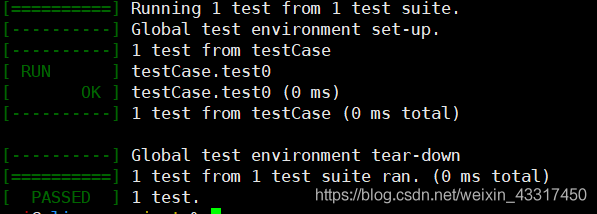
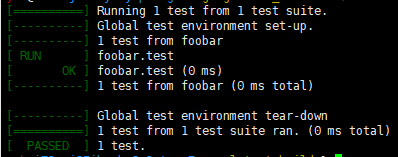
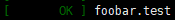
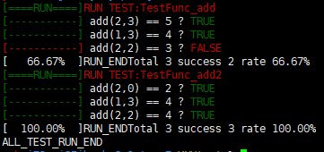
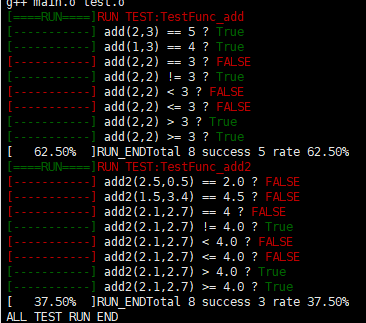

# 什么是GoogleTest（谷歌测试框架）

谷歌开发的针对C++开发的测试

gtest是一个跨平台的(Liunx、Mac OS X、Windows、Cygwin、Windows CE and Symbian)C++单元测试框架，由google公司发布。

gtest是为在不同平台上为编写C++测试而生成的。它提供了丰富的断言、致命和非致命判断、参数化、”死亡测试”等等。

一句话就是Gtest提供了一种自动化测试程序的框架。方便快速的验证程序的逻辑性和健壮性。

# 安装

基本过程为下载源码并使用make编译

https://www.cnblogs.com/helloworldcode/p/9606838.html

编译之前先创建一个编译目录googletest-build，这样避免在源码目录进行编译造成污染问题。

创建文件夹

```
mkdir googletest-build
	//googletest和googletest-build为同级目录
cd googletest-build
```

编译

```
cmake ../googletest
	//后面的选项为源代码的目录
//cmake CMakeLists.txt
	如果是在源码目录进行
make	//编译
make install
	//安装
```

最后一步出问题的话，也可以手动拷贝一些问题到系统目录(/usr)中

```
sudo cp libgtest*.a /usr/lib
		//静态链接库，make编译后产生，在lib目录中
sudo cp –a include/gtest /usr/include
	//include的位置
	//make前在/googletest/googletest/目录
	//make后_install目录下
```


或者也可以自己手动进行编译

先将测试生成可链接对象```g++ -std=c++11 -c test.cpp```（注意c++11）

然后手动链接之前编译生成的静态链接库```g++  test.o -L./lib -lgtest```（-L表示临时添加./lib目录为系统目录，-l表示添加gtest静态链接）

## 测试安装是否出问题

测试代码：（保存为test.cpp）

```
#include<gtest/gtest.h>
int add(int a,int b){
    return a+b;
}
TEST(testCase,test0){
    EXPECT_EQ(add(2,3),5);
}
int main(int argc,char **argv){
  testing::InitGoogleTest(&argc,argv);
  return RUN_ALL_TESTS();
}
```

编译命令：

```
g++ test.cpp -std=c++11 -lgtest -lpthread
```

运行：

```
./a.out
```

效果：



## 其它问题：

### 在make时报错

在安装包的googletest文件夹下(~/googletest/CMakeList.txt)找到CmakeLists.txt， 在其最上面添加如下语句：

```
SET(CMAKE_CXX_FLAGS "-std=c++0x")
```

### g++时出错

```
g++ test.cpp -lgtest -lpthread

g++ test.cpp -std=c++11 -lgtest -lpthread
在编译时出现这种错误，请用第二条命令编译
```


参考

https://www.cnblogs.com/helloworldcode/p/9606838.html


https://blog.csdn.net/sevenjoin/article/details/89953950

https://blog.csdn.net/sevenjoin/article/details/89962344

# 复现思路及分析

首先分析一下我们的测试代码（拷贝过来如下所示）以及效果图

```
#include <gtest/gtest.h>
int foobar()
{
    return 1;
}
TEST(foobar, test)
{
    ASSERT_EQ(foobar(),1);
}
int main(int argc, char *argv[])
{
    testing::InitGoogleTest(&argc, argv);
    return RUN_ALL_TESTS();
}
```



## 关于RUN_ALL_TESTS()+TEST()的作用及实现

调用该函数才会执行测试“函数”TEST，不调用则不起效果，因此一定存在某种方式，记录所有的测试“函数”TEST，然后RUN_ALL_TEST()依次调用记录的函数。

通过资料查询，我发现了一个超过自己认知的东西。

一般认为c\c++程序的执行都是从main函数开始的，但是如果某个函数添加了```__attribute__((constructor))```属性，他就可以在main函数之前执行了

> https://www.geeksforgeeks.org/__attribute__constructor-__attribute__destructor-syntaxes-c/
>
> https://blog.csdn.net/tianmohust/article/details/45310349

因此在一定存在一个部分 在main前将所有的测试函数的入口记录了下来，然后在RUN_ALL_TESTS()中逐个调用。

关于TEST()是一个函数的说法，显然是不符合语法规范的（他没有返回值），因此它可能是一个宏，TEST及其后面部分，行为像是一个函数，因此，TEST应该是将其两个参数作为函数的声明部分，再结合RUN_ALL_TESTS，其宏定义应该类似于

```
#define TEST(a,b)\
	//调用__attribute__((constructor))属性的函数，记录该测试函数的入口
	//该测试函数的声明部分
```

在之后是EXPECT_TRUE();  (或者说 ASSERT_EQ(); )他的参数列表也不是传递函数指针，因此它也可能是一个宏，再结合输出部分的，他的作用是一个调用函数并输出是否匹配。

## 关于输出的颜色部分

简单来说，就是和编程语言无关的终端的ANSI转义。当遇到```\033[31m```时将输出的颜色变更（具体例子是 前景色 变为红色，```\e[0m```是恢复默认）

更多内容参考

> https://my.oschina.net/dingdayu/blog/1537064
>
> https://www.cnblogs.com/clover-toeic/p/4031618.html

初版内容见目录```gtest\ver0.2```

效果图：




# 版本迭代

## ver0.3

1.增加其它表达式，`!=,>,>=,<,<=`

实现方式，宏嵌套（不同表达式将的区别 仅仅是符号不同）

具体实现类似下方所示：

```
EXPECT(a,b,cmp)//作为最终形式，cmp用来区分符号
EXPECT_EQ(a,b) EXPECT(a,b,==)
EXPECT_NQ(a,b) EXPECT(a,b,!=)
```

2.验证double类型是否正常

add为int加法，add2为double加法

效果展示：




# 其它说明

> 具体代码详见文件夹gtest下
>
> 所有代码均测试编译通过
>
> 测试平台
>
> ```
> LSB Version:	core-9.20160110ubuntu0.2-amd64:core-9.20160110ubuntu0.2-noarch:security-9.20160110ubuntu0.2-amd64:security-9.20160110ubuntu0.2-noarch
> Distributor ID:	Ubuntu
> Description:	Ubuntu 16.04.7 LTS
> Release:	16.04
> Codename:	xenial
> ```

